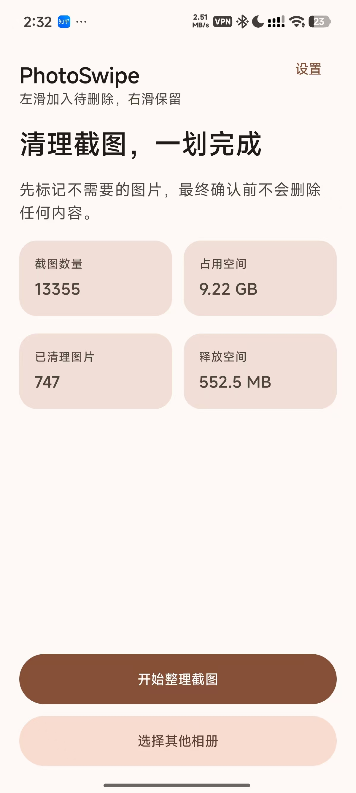
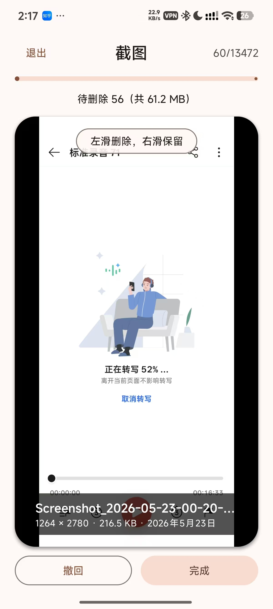
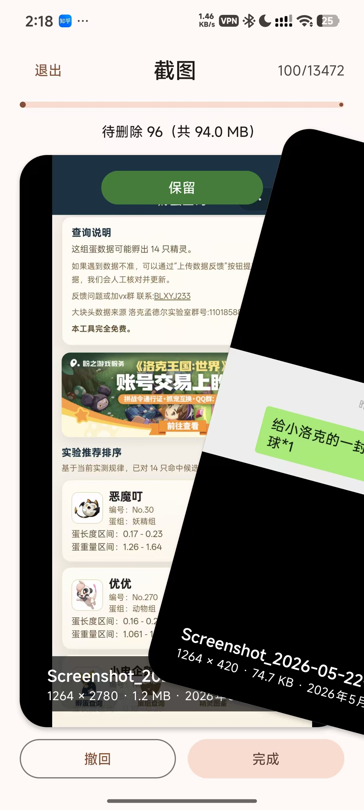

# PhotoSwipe

<a href="README.md">中文</a>

## Introduction

When I changed phones during the 618 shopping festival, I found more than ten thousand screenshots in my gallery. Most were images left over from sharing information with friends, but some were memorable moments from games. Deleting everything felt wasteful, while selecting and deleting photos one by one in the system gallery was tedious.

PhotoSwipe was created for this reason: it is inspired by the card-based left and right swipes used in dating apps. Swipe left to mark a photo for deletion, swipe right to keep it, and pinch to zoom in on long screenshots. Review the selection and confirm the deletion at the end to make screenshot cleanup easier.

## Core features

- Mainly designed for cleaning up screenshots, but it can also organize local photos by album.
- Swipe left to mark a photo for deletion, swipe right to keep it, and undo when needed.
- Drag and zoom to inspect photo details.

## Download

Go to [GitHub Releases](../../releases) to download the latest APK.

## Screenshots

  
  
  

